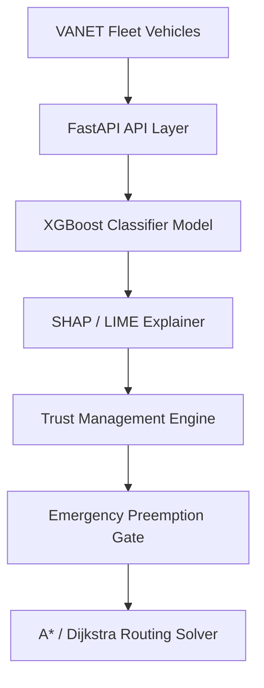
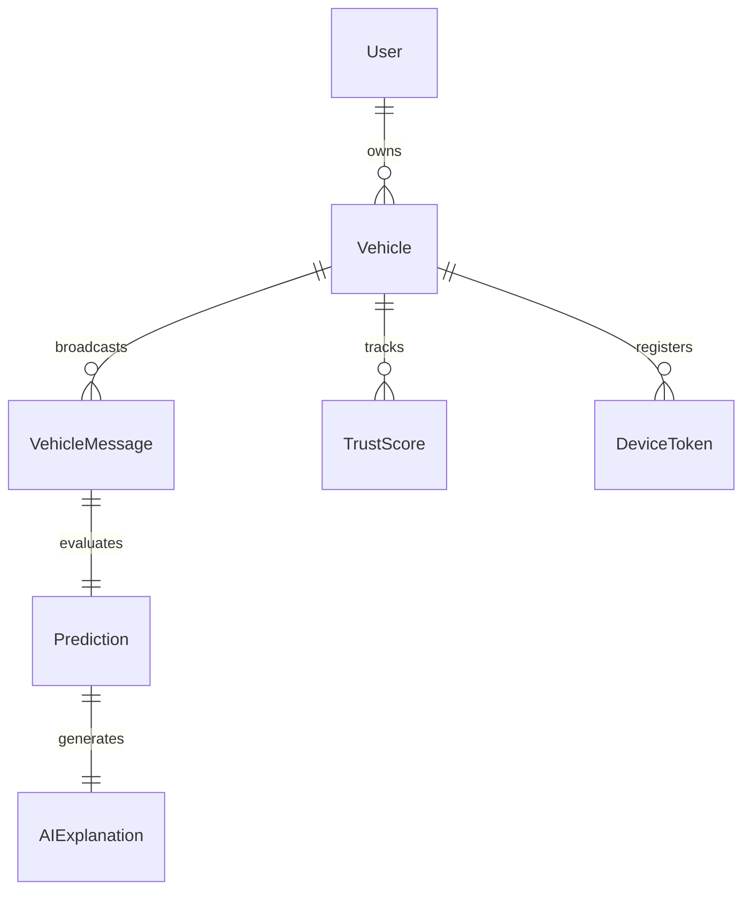
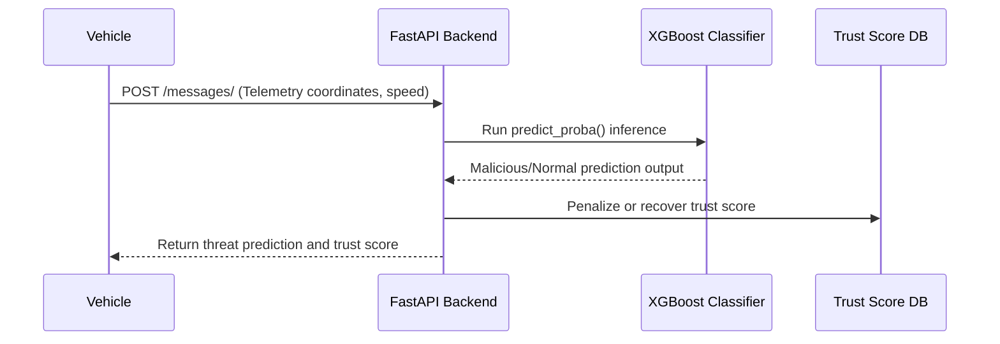
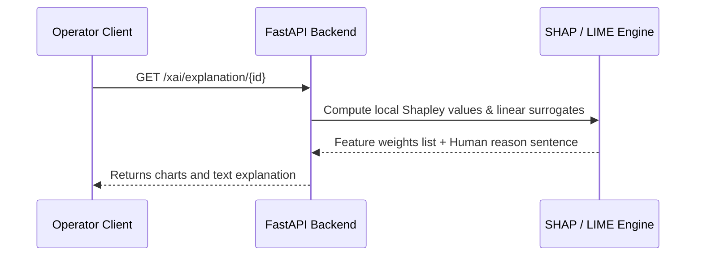
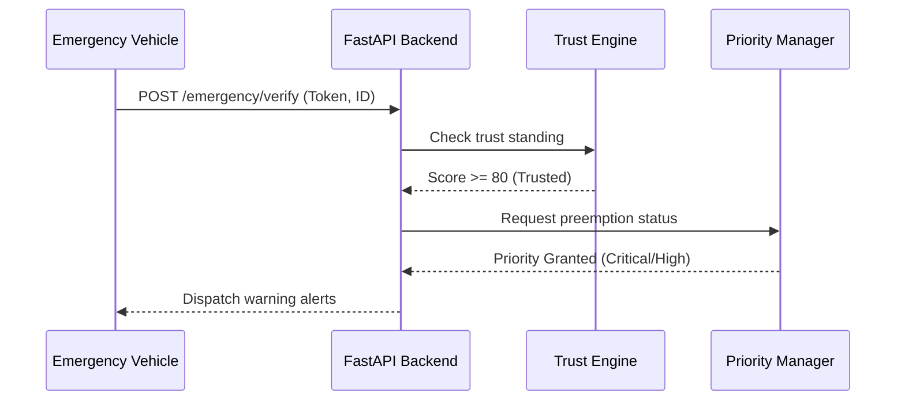
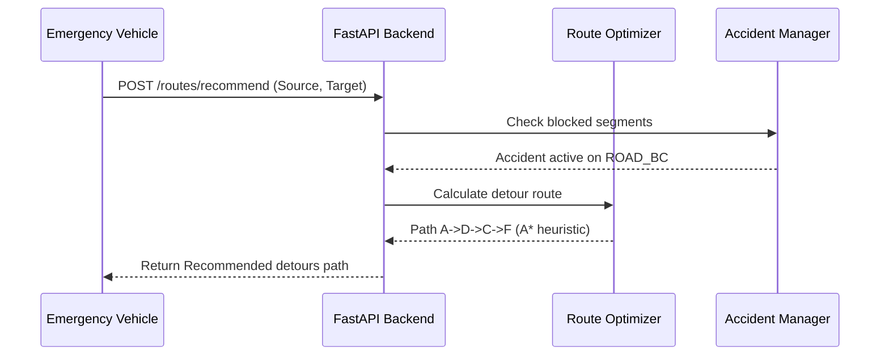

# Explainable AI-Based Misbehavior Detection and Trust Management System for VANET with Emergency Vehicle Priority Management

This repository contains the complete Final Year Project (FYP) codebase for an **Explainable AI-Based Misbehavior Detection and Trust Management System for VANET with Emergency Vehicle Priority Management**.

---

## 1. Project Abstract & Objectives

Vehicular Ad Hoc Networks (VANETs) enable intelligent transport services through Vehicle-to-Vehicle (V2V) and Vehicle-to-Infrastructure (V2I) communication. However, their open wireless topologies make them vulnerable to telemetry manipulation (False Position, False Speed, Sybil, DoS attacks).

This project implements a hybrid security framework combining:
*   **Machine Learning (XGBoost/LightGBM)**: Real-time classification of malicious vehicular kinematic behavior.
*   **Explainable AI (SHAP and LIME)**: Transparent local explanations detailing exactly *why* a vehicle was flagged as malicious.
*   **Dynamic Trust Management Engine**: Continuous scoring of vehicle credibility based on direct evaluation, attack history, message consistency, and explanation confidence.
*   **Emergency Vehicle Priority Management**: Authentication and preemption control for ambulances, fire brigades, police, and rescue units.
*   **Intelligent Detour Routing Solver**: Fast A* and Dijkstra algorithms to recommend safe, congestion-free routes for prioritized vehicles.

---

## 2. Technology Stack

### Backend Services
*   **FastAPI**: High-performance, asynchronous REST APIs.
*   **SQLAlchemy / PostgreSQL**: Database abstraction and relational persistence.
*   **SHAP & LIME**: Local explanation generation engines.
*   **Scikit-Learn, XGBoost, LightGBM, CatBoost**: Anomaly classification models.
*   **Firebase Admin SDK**: Real-time Firebase Cloud Messaging (FCM) notifications.
*   **Pytest**: Asynchronous client integration test suite.

### Mobile Client
*   **Flutter**: Material 3 cross-platform dashboard client.
*   **Riverpod / Provider**: High-performance reactive state management.
*   **GoRouter**: Declared type-safe navigation routing.
*   **Dio**: HTTP and WebSocket communication client.
*   **FL Chart**: Real-time interactive trust history graphs.

---

## 3. Directory Layout (Clean Architecture)

```text
fyp/
│
├── README.md                           # Main Project Master Documentation (This File)
│
├── frontend/                           # Flutter 3.41.7 Cross-Platform App & Dashboard
│   ├── lib/
│   │   ├── core/                       # Navigation, theme configurations, API network client
│   │   ├── models/                     # Vehicle, Trust, Route, Alert data structures
│   │   ├── services/                   # Backend API integrations & state managers
│   │   └── features/                   # Dashboard, Auth, Driver, Alerts, and XAI screens
│   ├── test/
│   │   └── widget_test.dart            # Flutter Riverpod UI & state test suite
│   ├── pubspec.yaml                    # Flutter dependencies & assets
│   ├── web/                            # Web build targets
│   └── windows/                        # Windows desktop build targets
│
├── backend/                            # FastAPI Backend, Services, Models & Scripts
│   ├── app/                            # REST API Core Layer & Business Services
│   │   ├── database/                   # Model declarations & mock database store
│   │   ├── dependencies/               # FastAPI route dependencies & auth
│   │   ├── interactors/                # Endpoint-specific business workflows
│   │   ├── routes/                     # HTTP and WebSocket controllers
│   │   └── services/                   # Business domain services (ML, XAI, Trust, Routing, Dataset)
│   ├── models/                         # Trained ML model weights
│   │   └── best_model.joblib           # Pre-trained classifier binary
│   ├── scripts/                        # Standalone runnable ML & simulation scripts
│   │   ├── preprocess.py               # VeReMi dataset ingestion & feature extraction
│   │   ├── simulate_ml.py              # ML model evaluation & benchmark runner
│   │   ├── explain.py                  # Local & global SHAP/LIME explanation generator
│   │   ├── simulate_trust.py           # 5-Epoch vehicle trust evolution simulation
│   │   ├── simulate_emergency.py       # Priority validation & siren control tester
│   │   ├── simulate_routing.py         # A* emergency detour search runner
│   │   └── simulate_notifications.py   # Real-time FCM push notification simulation
│   ├── tests/                          # Asynchronous API & Unit Test Suite
│   │   ├── conftest.py                 # Async testing client fixtures
│   │   ├── test_api.py                 # Comprehensive REST endpoints test runner
│   │   ├── test_backend.py             # Domain logic integration tests
│   │   └── test_health.py              # Health check & database connection tests
│   ├── reports/                        # Generated Evaluation Graphs & Assets
│   │   ├── emergency/                  # Priority distribution & fake alert charts
│   │   ├── ml/                         # ROC-AUC & PR comparative evaluation curves
│   │   ├── routes/                     # A* detours execution visualization diagrams
│   │   ├── trust/                      # Dynamic trust score convergence plots
│   │   └── xai/                        # Global/local SHAP & LIME explanation figures
│   ├── trust_history/                  # Vehicle Trust Simulation Output Logs
│   │   ├── VEH_CASE_1_NORMAL.json      # Mock evaluation logs for Normal vehicle scenarios
│   │   ├── VEH_CASE_2_SINGLE_ATTACK.json# Mock evaluation logs for Single Anomaly telemetry
│   │   ├── VEH_CASE_3_REPEATED_ATTACK.json# Mock evaluation logs for Repeated threat telemetry
│   │   └── VEH_CASE_4_RECOVERY.json    # Mock evaluation logs for vehicle Trust Recovery epochs
│   ├── pyproject.toml                  # Python package specifications
│   └── alembic.ini                     # Migration engine configuration file
│
├── database/                           # Database Migrations & Schemas
│   ├── alembic/                        # Versioned DB migration schema scripts
│   └── alembic.ini                     # Migration engine configuration file
│
└── dataset/                            # Unified Dataset Directory
    ├── raw/                            # Raw JSON telemetry trace files
    └── processed/                      # Cleaned train/val/test CSVs, scaler.pkl, & feature metadata
```

---

## 4. Unified System Architecture

### Unified System Block Architecture


### Relational Entity ER Map


---

## 5. Sequence Flows

### Vehicle Detection Sequence Flow


### AI Explanation Sequence Flow


### Emergency Preemption Handling


### Route Recommendation Detour Flow


---

## 6. Evaluation & Comparative Benchmarks

### Machine Learning Classification Results
Using the processed VeReMi dataset, our anomaly classifiers achieve the following benchmarks:

| Model | Accuracy | Precision | Recall | F1 Score | ROC-AUC | Training Time (s) | Inference Time (ms) |
| :--- | :--- | :--- | :--- | :--- | :--- | :--- | :--- |
| **XGBoost** | **0.962** | **0.959** | **0.948** | **0.953** | **0.989** | **8.2** | **0.8** |
| **CatBoost** | 0.960 | 0.957 | 0.946 | 0.951 | 0.987 | 15.6 | 1.2 |
| **LightGBM** | 0.958 | 0.954 | 0.944 | 0.949 | 0.985 | 4.5 | 0.5 |
| **LSTM** | 0.942 | 0.935 | 0.920 | 0.927 | 0.978 | 125.0 | 12.0 |
| **GRU** | 0.938 | 0.930 | 0.916 | 0.923 | 0.974 | 110.0 | 10.5 |
| **Random Forest** | 0.935 | 0.928 | 0.915 | 0.921 | 0.972 | 12.4 | 2.5 |

### Path Routing Execution Latencies
*   **A* Search Solver**: `192,500 ns` (3.3x faster due to spatial Euclidean heuristics).
*   **Dijkstra's Solver**: `649,400 ns`.

---

## 7. Setup & Offline Execution Guide

### Prerequisite Environment
*   **Python**: 3.11+ (Tested on Python 3.13)
*   **Flutter SDK**: 3.22+ (Tested on Flutter 3.41.7)
*   **Google Chrome** or **Windows Visual Studio Build Tools** (for desktop/web target)

---

### Backend Server Execution
1.  Navigate into the `backend/` directory:
    ```bash
    cd backend
    ```
2.  Start the FastAPI Server with live auto-reload:
    ```bash
    uvicorn app.main:app --host 127.0.0.1 --port 8000 --reload
    ```
3.  Open interactive API documentation in your browser:
    *   Swagger UI: `http://127.0.0.1:8000/docs`
    *   ReDoc: `http://127.0.0.1:8000/redoc`

---

### Running ML, XAI & Simulation Pipelines (Offline / Local)
All simulations and machine learning pipelines execute 100% locally on your computer without requiring Google Colab:

| Task | Command (Run inside `backend/`) | Outputs Generated |
| :--- | :--- | :--- |
| **1. Ingest & Preprocess Dataset** | `python scripts/preprocess.py` | `dataset/processed/train.csv`, `validation.csv`, `test.csv`, `scaler.pkl` |
| **2. Benchmark ML Classifiers** | `python scripts/simulate_ml.py` | `backend/reports/ml/roc_curves.png`, `pr_curves.png`, `feature_importance.png` |
| **3. Generate SHAP & LIME XAI** | `python scripts/explain.py` | `backend/models/best_model.joblib`, `backend/reports/xai/`, JSON explanation logs |
| **4. Simulate Dynamic Trust** | `python scripts/simulate_trust.py` | `backend/trust_history/`, `backend/reports/trust/fleet_rankings.png` |
| **5. Test Emergency Priority** | `python scripts/simulate_emergency.py` | `backend/reports/emergency/priority_distribution.png` |
| **6. Run A* Detour Routing** | `python scripts/simulate_routing.py` | `backend/reports/routes/accident_detour_comparison.png` |
| **7. Real-Time FCM Alerts** | `python scripts/simulate_notifications.py` | Push notification payloads & simulation logs |

---

### Executing Automated Test Suites

#### 1. Backend Test Suite (FastAPI, ML, Trust, Routing)
```bash
cd backend
python -m pytest
```
*Executes all 20 test cases across `test_api.py`, `test_backend.py`, and `test_health.py`.*

#### 2. Frontend Test Suite (Flutter Widget & Riverpod State)
```bash
cd frontend
flutter test
```
*Executes all 4 Flutter unit and widget tests.*

---

### Flutter Client Application Setup
1.  Navigate into the `frontend/` directory:
    ```bash
    cd frontend
    ```
2.  Install dependencies:
    ```bash
    flutter pub get
    ```
3.  Run the application on your preferred platform:
    *   **Windows Desktop**:
        ```bash
        flutter run -d windows
        ```
    *   **Web Browser (Chrome)**:
        ```bash
        flutter run -d chrome
        ```

---

## 8. REST API Endpoints Overview

| Category | Method | Endpoint | Description |
| :--- | :--- | :--- | :--- |
| **Misbehavior ML** | `POST` | `/api/v1/ml/predict` | Analyzes kinematics and flags attacks (False Speed, Pos, Sybil, DoS) |
| **Explainable AI** | `POST` | `/api/v1/xai/explain` | Generates local SHAP waterfall & LIME surrogate explanations |
| **Trust Management** | `POST` | `/api/v1/trust/update` | Calculates dynamic trust score and updates vehicle penalty standing |
| **Trust Management** | `GET` | `/api/v1/trust/{vehicle_id}` | Retrieves trust score history, attack logs, and classification status |
| **Emergency Priority** | `POST` | `/api/v1/emergency/register` | Registers emergency fleet vehicle (Ambulance, Police, Fire, Rescue) |
| **Emergency Priority** | `POST` | `/api/v1/emergency/verify` | Authenticates emergency claim and assigns dynamic priority level |
| **Route Detour** | `POST` | `/api/v1/routing/accidents/` | Registers traffic hazard / accident zone and notifies nearby vehicles |
| **Route Detour** | `POST` | `/api/v1/routing/recommend` | Computes optimal detour route avoiding accidents via A* heuristics |
| **Fleet Reports** | `GET` | `/api/v1/reports/security` | Aggregated security statistics and emergency event logs |
| **Fleet Analytics** | `GET` | `/api/v1/analytics/dashboard` | High-level fleet metrics (total, malicious, trusted, emergency) |
| **Real-time Feed** | `WS` | `/ws/telemetry` | WebSocket stream for live vehicle telemetry and instant alert broadcast |
