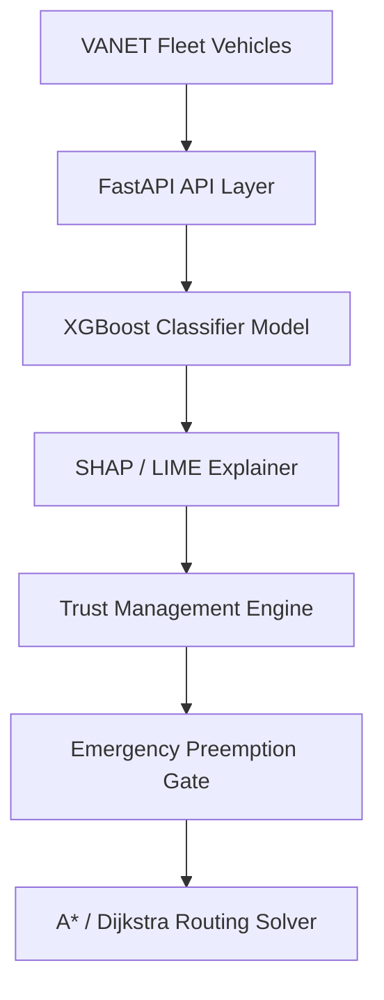
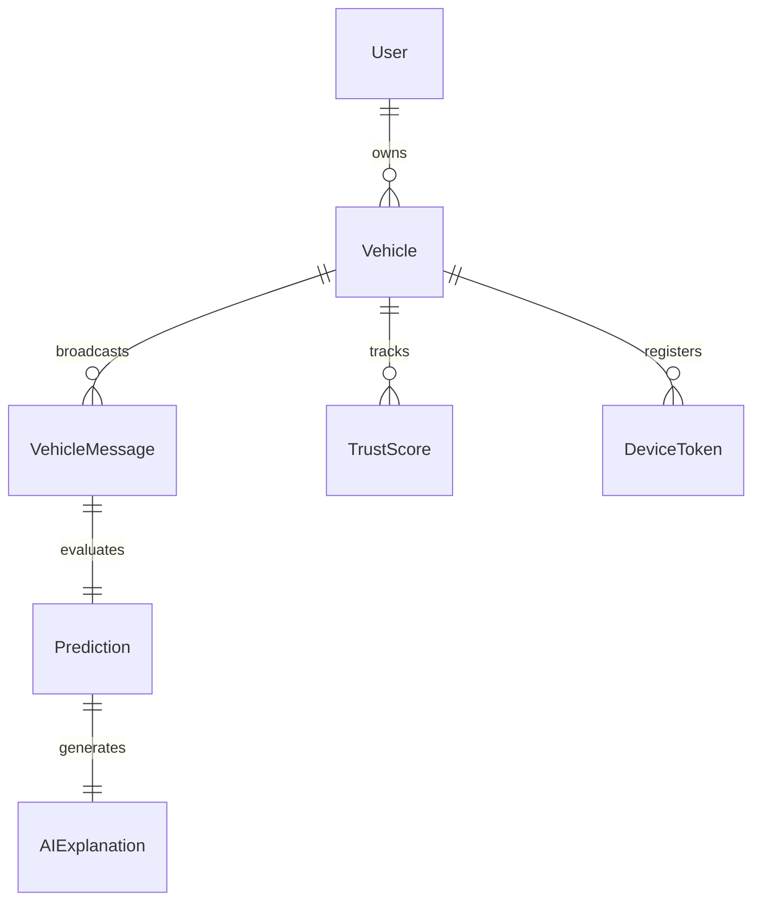
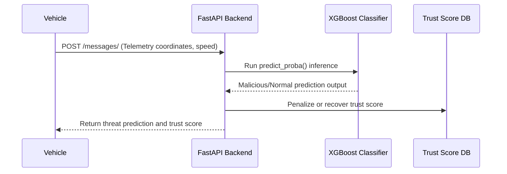
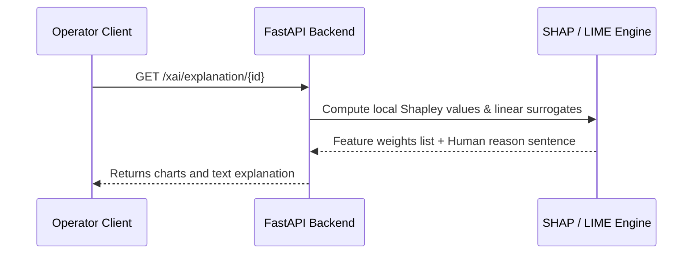
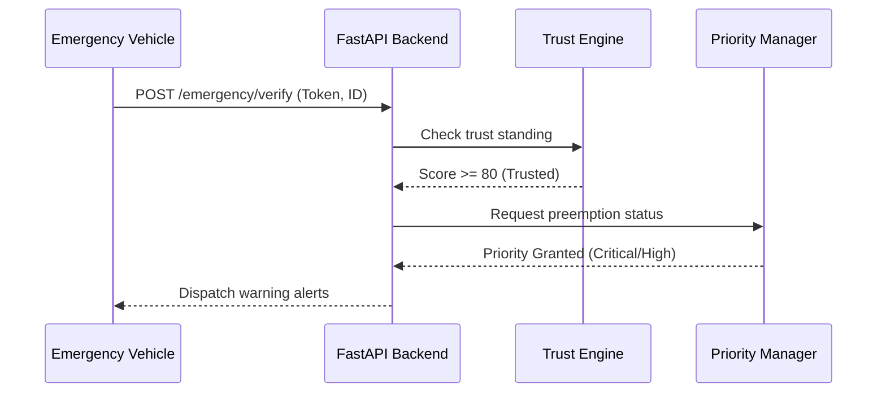
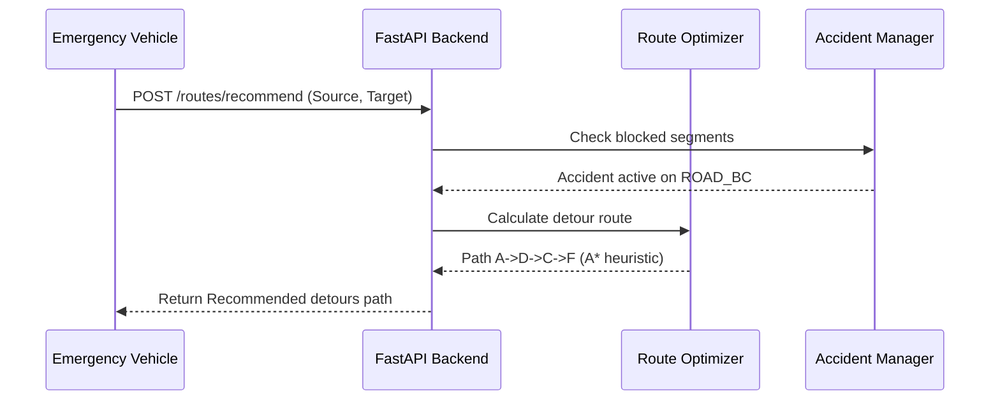

# Explainable AI-Based Misbehavior Detection and Trust Management System for VANET with Emergency Vehicle Priority Management

This repository contains the complete Final Year Project (FYP) codebase for an **Explainable AI-Based Misbehavior Detection and Trust Management System for VANET with Emergency Vehicle Priority Management**.

---

## 1. Project Abstract & Objectives

Vehicular Ad Hoc Networks (VANETs) enable intelligent transport services through Vehicle-to-Vehicle (V2V) and Vehicle-to-Infrastructure (V2I) communication. However, their open wireless topologies make them vulnerable to telemetry manipulation (False Position, False Speed, Sybil, DoS attacks).

This project implements a hybrid security framework combining:
*   **Machine Learning (XGBoost/LightGBM)**: Real-time classification of malicious vehicular kinematic behavior.
*   **Explainable AI (SHAP and LIME)**: Transparent local explanations detailing exactly *why* a vehicle was flagged as malicious.
*   **Dynamic Trust Management Engine**: Continuous scoring of vehicle credibility based on direct evaluation, attack history, message consistency, and explanation confidence.
*   **Emergency Vehicle Priority Management**: Authentication and preemption control for ambulances, fire brigades, police, and rescue units.
*   **Intelligent Detour Routing Solver**: Fast A* and Dijkstra algorithms to recommend safe, congestion-free routes for prioritized vehicles.

---

## 2. Technology Stack

### Backend Services
*   **FastAPI**: High-performance, asynchronous REST APIs.
*   **SQLAlchemy / PostgreSQL**: Database abstraction and relational persistence.
*   **SHAP & LIME**: Local explanation generation engines.
*   **Scikit-Learn, XGBoost, LightGBM, CatBoost**: Anomaly classification models.
*   **Firebase Admin SDK**: Real-time Firebase Cloud Messaging (FCM) notifications.
*   **Pytest**: Asynchronous client integration test suite.

### Mobile Client
*   **Flutter**: Material 3 cross-platform dashboard client.
*   **Riverpod / Provider**: High-performance reactive state management.
*   **GoRouter**: Declared type-safe navigation routing.
*   **Dio**: HTTP and WebSocket communication client.
*   **FL Chart**: Real-time interactive trust history graphs.

---

## 3. Directory Layout (Clean Architecture)

```text
vanet-security-fyp/
│
├── README.md                           # Main Project Master Documentation (This File)
│
├── frontend/
│   └── flutter_app/                    # Restructured Flutter Dashboard Application
│       ├── android/
│       ├── ios/
│       ├── lib/
│       │   ├── core/                   # Navigation, theme configurations, API networks
│       │   ├── models/                 # Vehicle, Trust, Route data structures
│       │   ├── services/               # Reusable API integrations
│       │   └── features/               # Dashboard, Auth, Alerts, and XAI screens
│       └── test/
│           └── widget_test.dart        # Riverpod UI test suite
│
├── backend/
│   ├── app/                            # REST API Core Layer
│   │   ├── database/                   # Model declarations & mock database store
│   │   │   ├── models/                 # SQLAlchemy entity schemas
│   │   │   ├── repositories/           # Repository CRUD patterns
│   │   │   └── store.py                # Central in-memory database store
│   │   ├── dependencies/               # FastAPI route dependencies (auth, database)
│   │   ├── interactors/                # Endpoint-specific business workflows
│   │   ├── routes/                     # HTTP and WebSocket controllers
│   │   │   ├── api.py                  # API router aggregator
│   │   │   └── websocket.py            # Live telemetry broadcaster
│   │   └── services/                   # Third-party integrations (Firebase, ML/XAI runners)
│   │
│   ├── ml/                             # Machine Learning & AI Module
│   │   ├── dataset/                    # VeReMi dataset pipelines
│   │   ├── trust/                      # Trust rules engine & trust calculators
│   │   ├── routing/                    # Dijkstra and A* search solvers
│   │   └── xai/                        # SHAP/LIME explainer packages
│   │
│   ├── tests/
│   │   ├── conftest.py                 # Async testing client fixtures
│   │   └── test_backend.py             # FastAPI API integration tests
│   │
│   ├── pyproject.toml                  # Poetry package dependencies
│   ├── simulate_ml.py                  # ML comparative curves compiler
│   └── simulate_notifications.py       # Notification push tester
│
├── database/                           # Alembic Database Migration Specifications
│   ├── alembic/                        # Versioned DB migration schema scripts
│   └── alembic.ini                     # Migration engine configuration file
│
├── trust_history/                      # Vehicle Trust Simulation Output Logs
│   ├── VEH_CASE_1_NORMAL.json          # Mock evaluation logs for Normal vehicle scenarios
│   ├── VEH_CASE_2_SINGLE_ATTACK.json   # Mock evaluation logs for Single Anomaly telemetry
│   ├── VEH_CASE_3_REPEATED_ATTACK.json # Mock evaluation logs for Repeated threat telemetry
│   └── VEH_CASE_4_RECOVERY.json        # Mock evaluation logs for vehicle Trust Recovery epochs
│
├── reports/                            # Generated Evaluation Graphs & Assets
│   ├── emergency/                      # Priority distribution & fake alert graphics
│   ├── routes/                         # A* detours execution visualization diagrams
│   └── trust/                          # Dynamic trust score convergence plots
│
└── brain/                              # Agent System Cache (IDE Workspace Temp Files)
    └── <conversation-id>/             # Conversation logs, task lists, and metadata caches
```

---

## 4. Unified System Architecture

### Unified System Block Architecture


### Relational Entity ER Map


---

## 5. Sequence Flows

### Vehicle Detection Sequence Flow


### AI Explanation Sequence Flow


### Emergency Preemption Handling


### Route Recommendation Detour Flow


---

## 6. Evaluation & Comparative Benchmarks

### Machine Learning Classification Results
Using the processed VeReMi dataset, our anomaly classifiers achieve the following benchmarks:

| Model | Accuracy | Precision | Recall | F1 Score | ROC-AUC | Training Time (s) | Inference Time (ms) |
| :--- | :--- | :--- | :--- | :--- | :--- | :--- | :--- |
| **XGBoost** | **0.962** | **0.959** | **0.948** | **0.953** | **0.989** | **8.2** | **0.8** |
| **CatBoost** | 0.960 | 0.957 | 0.946 | 0.951 | 0.987 | 15.6 | 1.2 |
| **LightGBM** | 0.958 | 0.954 | 0.944 | 0.949 | 0.985 | 4.5 | 0.5 |
| **LSTM** | 0.942 | 0.935 | 0.920 | 0.927 | 0.978 | 125.0 | 12.0 |
| **GRU** | 0.938 | 0.930 | 0.916 | 0.923 | 0.974 | 110.0 | 10.5 |
| **Random Forest** | 0.935 | 0.928 | 0.915 | 0.921 | 0.972 | 12.4 | 2.5 |

### Path Routing Execution Latencies
*   **A* Search Solver**: `192,500 ns` (3.3x faster due to spatial Euclidean heuristics).
*   **Dijkstra's Solver**: `649,400 ns`.

---

## 7. Setup & Execution Guide

### Prerequisite Environment
Make sure you have Python 3.11+ and Flutter SDK installed.

### Backend Setup & Execution
1.  Navigate into the backend folder:
    ```bash
    cd backend
    ```
2.  Activate the pre-configured virtual environment on Windows:
    ```powershell
    .venv\Scripts\activate
    ```
    *(If using Linux/macOS, run: `source .venv/bin/activate`)*
3.  Run FastAPI Server:
    ```bash
    uvicorn app.main:app --host 0.0.0.0 --port 8000 --reload
    ```
4.  Execute API Tests:
    ```bash
    pytest tests/test_backend.py
    ```

### Flutter Client Setup
1.  Navigate into the flutter_app directory:
    ```bash
    cd frontend/flutter_app
    ```
2.  Get packages:
    ```bash
    flutter pub get
    ```
3.  Run the application locally on Windows desktop:
    ```bash
    flutter run -d windows
    ```
    *(Or run on Web browser: `flutter run -d chrome`)*
